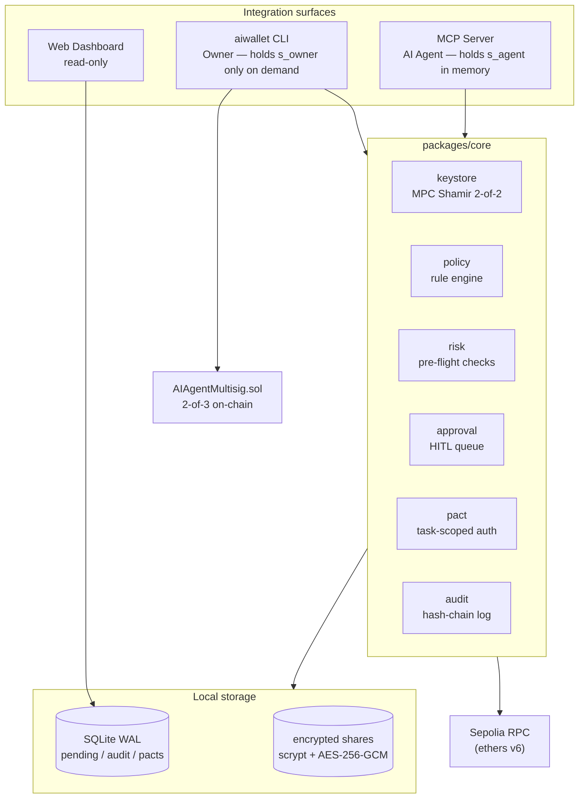

# AI Agent Wallet

> **License — Evaluation Only.** This repository is provided to a prospective
> employer solely for evaluating the author's work during a recruitment process.
> Commercial use, production deployment, redistribution, and derivative works
> are not permitted without the author's written consent. See
> [LICENSE.md](LICENSE.md) for full terms.

A purpose-built Ethereum (Sepolia) wallet for autonomous AI Agents. Designed
around three problems unique to AI operators:

1. **Unbypassable key isolation** via 2-of-2 MPC sharding (Owner + Agent shares).
2. **Decision transparency** via declarative policy and tamper-evident audit log.
3. **Runtime defenses** against address hallucination, replay, and ERC-20 misuse.

The wallet exposes itself through three surfaces:

- `aiwallet` CLI for the human Owner (init, approve, daemon, audit, multisig).
- An MCP server for AI Agents (Claude Code, Cursor, OpenClaw).
- A read-only Web Dashboard.

It also ships a Solidity 2-of-3 multisig contract (`AIAgentMultisig`) for treasury flows.

## Architecture at a glance



Trust boundary: the MCP process is treated as untrusted (Agent instructions flow through it) and never holds `s_owner`. All signing happens inside the CLI process.

## Where to look first

Recommended reading order for a quick review:

1. **[`docs/02-key-problems.md`](docs/02-key-problems.md)** — the three problems and how the wallet solves each.
2. **[`docs/03-architecture.md`](docs/03-architecture.md)** — modules, trust boundaries, threat model, hash-chain spec.
3. **[`packages/core/src/wallet.ts`](packages/core/src/wallet.ts)** — wallet façade tying every module together.
4. **[`packages/core/src/keystore/keystore.ts`](packages/core/src/keystore/keystore.ts)** — MPC sharding (with the demo-simulation banner).
5. **[`packages/core/src/pact/manager.ts`](packages/core/src/pact/manager.ts)** — task-scoped authorization (the differentiating abstraction).
6. **[`packages/contracts/contracts/AIAgentMultisig.sol`](packages/contracts/contracts/AIAgentMultisig.sol)** — ~150-line 2-of-3 multisig, written from scratch.
7. **[`scripts/e2e-demo.ts`](scripts/e2e-demo.ts)** — runs offline; exercises auto / HITL / deny end-to-end via `pnpm demo`.

## Submission docs

- [`docs/01-personas-and-scenarios.md`](docs/01-personas-and-scenarios.md) — Personas and use cases
- [`docs/02-key-problems.md`](docs/02-key-problems.md) — Three problems we solve
- [`docs/03-architecture.md`](docs/03-architecture.md) — Architecture overview
- [`docs/04-ai-collaboration.md`](docs/04-ai-collaboration.md) — Process notes for the AI-assisted build

## Quickstart

Requirements: Node 20, pnpm 9.

```bash
git clone https://github.com/Boming0002/ai-agent-wallet.git
cd ai-agent-wallet
pnpm install
pnpm -r build
pnpm test
```

### Initialize a wallet

```bash
export AGENT_SHARE_PASS=$(openssl rand -hex 16)
export OWNER_SHARE_PASS=$(openssl rand -hex 16)
node packages/cli/dist/index.js init
node packages/cli/dist/index.js status
```

Fund the printed address from the [Sepolia faucet](https://sepoliafaucet.com).

### Run the e2e demo (no broadcasting)

```bash
pnpm demo
```

The demo creates a fresh wallet in a temp directory, sets a tight policy, proposes
three transactions (auto-approve / HITL / deny), verifies the audit hash chain, and
cleans up — all offline. Set `SEPOLIA_RPC_URL` to run risk simulation against a live
Sepolia node instead.

### Wire the MCP server into Claude Code

See [`packages/mcp-server/README.md`](packages/mcp-server/README.md) for full
configuration. Quick reference — add to your Claude Code `settings.json`:

```json
{
  "mcpServers": {
    "aiwallet": {
      "command": "node",
      "args": ["packages/mcp-server/dist/index.js"],
      "env": {
        "WALLET_DATA_DIR": "/path/to/your/wallet-data",
        "AGENT_SHARE_PASS": "...",
        "SEPOLIA_RPC_URL": "..."
      }
    }
  }
}
```

### Deploy the multisig contract

```bash
cd packages/contracts
export DEPLOYER_PRIVATE_KEY=0x...           # funded Sepolia EOA
export MULTISIG_SIGNERS=0xAAA...,0xBBB...,0xCCC...
pnpm deploy:sepolia
```

## Repository layout

```
packages/
  core/          — wallet façade, policy engine, risk module, audit log, MPC keystore
  cli/           — aiwallet CLI (init / status / approve / reject / audit / policy / pact / multisig)
  mcp-server/    — MCP server exposing propose_tx, list_pending, approve, reject, list_pacts, …
  dashboard/     — read-only React + Express web dashboard
  contracts/     — AIAgentMultisig Solidity 2-of-3 multisig + Hardhat deploy scripts
scripts/
  e2e-demo.ts    — end-to-end demo (runs offline, no broadcasting)
docs/
  01-personas-and-scenarios.md
  02-key-problems.md
  03-architecture.md
  04-ai-collaboration.md
```

## Honest scope notes

- The MPC is a **documented simulation** using 2-of-2 Shamir split + in-process
  reconstruction in the trusted CLI/daemon. Real production TSS (GG18, MP-ECDSA) is
  out of scope; the threat-model story (Agent process never holds the full key) is
  preserved.
- Sepolia testnet only.
- The Web Dashboard is read-only (no signing surface in the browser).
